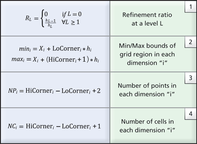

# Guide

All the workflows here is not restricted to one type of model output. After being familiar with new ideas and new models, one can easily make use of existing samples and create reader of their own.

## Interoperability

Demos are provided for calling Matlab/Python directly from Julia for debugging and testing. This part will later be separated out for potential Python and Matlab users. Currently the plotting and interpolation needed during plotting are done in Python. For instance, the 3D scatterred interpolation is done via `Interpolate` in Scipy. Hopefully these additional dependencies will be cut down.

## Tricks

- This is the first time I use Julia for reading general ascii/binary files. It was a pain at first due to the lack of examples and documents using any basic function like read/read!, but fortunately I figured them out myself. One trick in reading binary array data is the usage of view, or subarrays, in Julia. In order to achieve that, I have to implement my own `read!` function in addition to the base ones.
- Tecplot and VTK unstructured data formats have the same connectivity ordering for hexahedron, but different ordering for voxel (in VTK). A function `swaprows` is implemented to switch the orderings.
- Because of the embarrassing parallelism nature of postprocessing, it is quite easy to take advantage of parallel approaches to process the data.

## Support for more complicated grid structures

The VTK files does not have timestep information. To allow for further time series processing in Paraview, a script `create_pvd.jl` is provided for generating the pvd container.

By default the file size will be reduced with compression level 6, but the actual compression ratio depends on the original data.

In principle, I could also try some multi-block (VTM) type for data conversion.

The XML package not only provide writing into XML files, but also reading XML structures. Therefore, if you want you can create a VTK reader.

For the plotting, streamline tracing and particle tracing, a common problem is the grid and related interpolation process. I am envisioning a more general approach to deal with block-based and unstructured grid to provide fundamental support for all of these.

Currently, BATSRUS output contains only cell center grid and cell center values. The multiblock VTK format conversion works, but it is incorrectly recognized as node center data. An ideal way is to output the original node coordinates and corresponding cell center values.

### AMR Grid Structure

`vtkOverlappingAMR` implements a somewhat strict Berger-Collela AMR scheme:
1. All grids are Cartesian.
2. Grids at the same level do not overlap.
3. The refinement ratios, RL, between adjacent levels are integer (typically 2 or 4) and uniform within the same level.
4. Grid cells are never partially refined; i.e., each cell is refined to four quads in 2D or eight hexahedra in 3D.

Or in other words,
* Refinement ratio across levels is constant.
* Each block at levels > 0 need to be covered 100% by one parent block of
previous level.
* Some other restriction about what happens at the boundary.

You can directly use `vtkUniformGridAMR`, which does not impose any
restrictions. Most filters should work for this class - there just wouldn't
be any specialized filters such as the dual-grid contour / clip ones for
the `vtkOverlappingAMR`.

The `vtkAMRInformation` documentation consists only of
* Refinement ratio between AMR levels
* Grid spacing for each level
* The file block index for each block parent child information, if requested

Sample 2D AMR Dataset with two levels and refinement ratio, RL=4. The root level (L0) consists of a single grid shown in black wireframe while the next level (L1) consists of two grids, depicted in green wireframe and red wireframe respectively. The two grids at L1 are projected from the root level to illustrate that the cells underneath are “hidden.”

In VTK, the collection of AMR grids is stored in a `vtkHierarchicalBoxDataSet` data-structure. Each grid, G(Li,k), is represented by a `vtkUniformGrid` data structure where the unique key pair (Li,k) denotes the corresponding level (Li) and the grid index within the level (k) with respect to the underlying hierarchical structure. An array historically known as `IBLANK`, stored as a cell attribute in `vtkUniformGrid`, denotes whether a cell is hidden or not. The blanking array is subsequently used by the mapper to hide lower resolution cells accordingly when visualizing the dataset.

To enable the execution of data queries without loading the entire dataset in memory, metadata information is employed. The metadata stores a minimal set of geometric information for each grid in the AMR hierarchy. Specifically, the AMR metadata, B(Li,k), corresponding to the grid G(Li,k), is represented using a `vtkAMRBox` object and it consists of the following information:

1. N={Nx, Ny, Nz} — the cell dimensions of the grid (since the data is cell-centered)
2. The grid spacing at level L, hL={hx,hy,hz}
3. The grid level Li and grid index k
4. The global dataset origin, X=(X0, Y0, Z0), i.e., the minimum origin from all grids in level L0
5. The LoCorner and HiCorner, which describe the low and high corners of the rectangular region covered by the corresponding grid in a virtual integer lattice with the same spacing (h) that covers the entire domain.

Given the metadata information stored in the AMR box of each grid, the refinement ratio at each level can be easily computed using relationship (1) from Table 1. Further, the cartesian bounds the corresponding grid covers and the number of points and cells is also available (see relationships 2-4 in Table 1). Notably, geometric queries such as determining which cell contains a given point, or if a grid intersects a user-supplied slice plane, can be answered using just the metadata.

There is a `vtkAMRDualExtractionFilter`, which constructs a dual-mesh (i.e., the mesh constructed by connecting the cell-centers) over the computational domain.
If we can directly tell ParaView that the mesh we have is a dual-mesh, then the initial trial with multi-block data may work directly.

##

A real open-source project is a collaborated work not only from a bunch of people, but also a group of languages. In Julia, this can be achieved with the help of the [Package manager](https://julialang.github.io/Pkg.jl/dev/).

I want to have some C dependencies in my code instead of rewriting everything in Julia. This would serve as an attempt to quickly make things work.

Right now this seems to be a little bit difficult for me. I need to learn from experts. The tracing scheme in C is rewritten in Julia so I don't need to bother for now.
Checkout [BinaryBuilder](https://juliapackaging.github.io/BinaryBuilder.jl/latest/#Project-flow-1) for more information.

## Custom VTK reader

ParaView allows for custom Python reader. Examples can be found in Chapter 12.4 in the official manual, and an example of full Python plugins can be found at Kiware's [gitlab](https://gitlab.kitware.com/paraview/paraview/blob/master/Examples/Plugins/PythonAlgorithm/PythonAlgorithmExamples.py) page.

## Issues

I am enlightened by the way SpacePy handles files. Instead of a separate header and data array, it may be better to build a more contained struct.
Also, the header could use `NamedTuple` instead of `Dict`.

And actually, by far there is no single use case where I need to read multiple files together. If you want to do so, just call the function twice.

Before v0.5.1, `readdata` function in Matlab for large data is 2 times faster than that in Julia. The reason is simply using `read` or `unsafe_read` in the lower level. The latter one is much faster. After the fix, Julia version performs 5 times faster than the Matlab version in reading binary data.

In the roadmap of PyCall 2.0, there will direct support for accessing Julia objects in Python. I have taken advantage of this and provide a Python interface to the package.

The support for a long string containing several filenames as inputs has been dropped. It should be substituted by an array of strings.

Right now the derived quantity plots are not supported. In order to achieve this, I may need:
- [x] A new function `get_var(data, filehead, string)` returning the derived variable
- [ ] A new plotting function that understands the derived data type

The first one is achieved by a trick I found on discourse, which basically identifies symbols as names to members in a struct.

Vector naming is messed up if you are using Tecplot VTK reader. For example, "B [nT]" --> "B [nT]_X", "B [nT]_Y", "B [nT]_Z". Not a big issue, but annoying.

There is a unit package in Julia [unitful](https://github.com/PainterQubits/Unitful.jl) for handling units. Take a look at that one if you really want to solve the unit problems.

I have encountered a very bad problem of corrupting binary *.vtu files. It turned out that the issue is the starting position of data is wrong because of the way I skip the header AUXDATA part. Sometimes the binary numbers may contain newline character that confuses the reader. It is now fixed. Later on the reading of the header part is completely rewritten to provide better support for a variety of Tecplot Ascii headers.

I have already made a lot of mistakes by mixing the row-major and column-major codes. Explicitly list all the parts that require extra care!

I have a new issue coming up with the interoperability with Python. I may need to split this package into pure IO and pure plotting to avoid the cross-dependency of Matplotlib. The idea is that PyPlot is only needed when I want to quickly scan through the data!

- [ ] Full coverage of tests
- [x] PyJulia support for manipulating data directly in Python
- [x] Derived variable support
- [x] General postprocessing script for concatenating and converting files.
- [x] Replace np.meshgrid with list comprehension
- [ ] Find a substitution of triangulation in Julia
- [ ] Allow dot syntax to get dictionary contents (Base.convert?)
- [ ] Binary library support
- [ ] VTK reader
