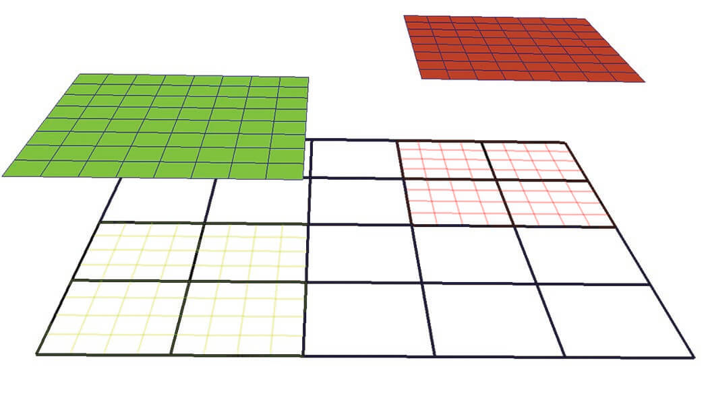
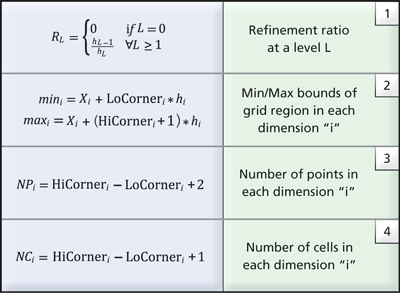

# Development Log

All the workflows here is not restricted to one type of model output. After being familiar with new ideas and new models, one can easily make use of existing samples and create reader of their own.
Because of the embarrassing parallelism nature of postprocessing, it is quite easy to take advantage of parallel approaches to process the data.

For the plotting, streamline tracing and particle tracing, a common problem is the grid and related interpolation process. Now I have [FieldTracer.jl](https://github.com/henry2004y/FieldTracer.jl) and [TestParticle.jl](https://github.com/henry2004y/TestParticle.jl) designed specifically for these tasks.

## Test Data

If you don't have SWMF data at hand, Batsrus.jl provides some test data for you to begin with.

```julia
using LazyArtifacts

datapath = artifact"testdata" # where you can find multiple test data files
```

These are also used in the standard test. These will be automatically downloaded from [batsrus_data](https://github.com/henry2004y/batsrus_data) if you run the package test locally.

### BATL AMR Grid Structure

The Block Adaptive Tree Library (BATL) used in Batsrus implements a block-based non-overlapping AMR scheme. Its key characteristics are:

1. **Block-Based**: The computational domain is divided into blocks (or patches). Every block contains exactly the same number of grid cells (e.g., $8 \times 8 \times 8$ in 3D).
2. **Octree Refinement**: When a region requires higher resolution, an entire block is refined by splitting it into $2^{nDim}$ child blocks ($8$ in 3D, $4$ in 2D). Each child block again has the same number of cells as the parent, meaning the spatial resolution is effectively doubled in each dimension.
3. **Non-Overlapping**: Only the leaf nodes of the AMR tree (the blocks at the highest local level of refinement) are active and used for computations. Child blocks completely replace their parent blocks. Therefore, active grids at different levels never overlap, and active grids at the same level abut each other perfectly.

In the `src/vtk.jl` code, the BATL AMR tree is managed via the `iTree_IA` array, which keeps track of each node's status (used, unused, refine, coarsen), level, local block index, spatial coordinates, and parent/child relationships.

## VTK AMR Grid Structure

`vtkOverlappingAMR` implements a somewhat strict Berger-Collela AMR scheme:

1. All grids are Cartesian.
2. Grids at the same level do not overlap.
3. The refinement ratios, RL, between adjacent levels are integer (typically 2 or 4) and uniform within the same level.
4. Grid cells are never partially refined; i.e., each cell is refined to four quads in 2D or eight hexahedra in 3D.

Or in other words,

* Refinement ratio across levels is constant.
* Each block at levels > 0 need to be covered 100% by one parent block of
previous level.
* Some other restriction about what happens at the boundary.

You can directly use `vtkUniformGridAMR`, which does not impose any
restrictions. Most filters should work for this class - there just wouldn't
be any specialized filters such as the dual-grid contour / clip ones for
the `vtkOverlappingAMR`.

The `vtkAMRInformation` documentation consists only of

* Refinement ratio between AMR levels
* Grid spacing for each level
* The file block index for each block parent child information, if requested


Sample 2D AMR Dataset with two levels and refinement ratio, RL=4. The root level (L0) consists of a single grid shown in black wireframe while the next level (L1) consists of two grids, depicted in green wireframe and red wireframe respectively. The two grids at L1 are projected from the root level to illustrate that the cells underneath are “hidden.”

In VTK, the collection of AMR grids is stored in a `vtkHierarchicalBoxDataSet` data-structure. Each grid, G(Li,k), is represented by a `vtkUniformGrid` data structure where the unique key pair (Li,k) denotes the corresponding level (Li) and the grid index within the level (k) with respect to the underlying hierarchical structure. An array historically known as `IBLANK`, stored as a cell attribute in `vtkUniformGrid`, denotes whether a cell is hidden or not. The blanking array is subsequently used by the mapper to hide lower resolution cells accordingly when visualizing the dataset.

To enable the execution of data queries without loading the entire dataset in memory, metadata information is employed. The metadata stores a minimal set of geometric information for each grid in the AMR hierarchy. Specifically, the AMR metadata, B(Li,k), corresponding to the grid G(Li,k), is represented using a `vtkAMRBox` object and it consists of the following information:

1. N={Nx, Ny, Nz} — the cell dimensions of the grid (since the data is cell-centered)
2. The grid spacing at level L, hL={hx,hy,hz}
3. The grid level Li and grid index k
4. The global dataset origin, X=(X0, Y0, Z0), i.e., the minimum origin from all grids in level L0
5. The LoCorner and HiCorner, which describe the low and high corners of the rectangular region covered by the corresponding grid in a virtual integer lattice with the same spacing (h) that covers the entire domain.



Given the metadata information stored in the AMR box of each grid, the refinement ratio at each level can be easily computed using relationship (1) from Table 1. Further, the cartesian bounds the corresponding grid covers and the number of points and cells is also available (see relationships 2-4 in Table 1). Notably, geometric queries such as determining which cell contains a given point, or if a grid intersects a user-supplied slice plane, can be answered using just the metadata.

There is a `vtkAMRDualExtractionFilter`, which constructs a dual-mesh (i.e., the mesh constructed by connecting the cell-centers) over the computational domain.
If we can directly tell ParaView that the mesh we have is a dual-mesh, then the initial trial with multi-block data may work directly.

`AMRGaussianPulseSource`

See [Multi-Resolution Rendering with Overlapping AMR](https://www.paraview.org/ParaView/index.php/Multi-Resolution_Rendering_with_Overlapping_AMR) for the implementation of C++ reader in VTK.

## Investigation: Converting BATL AMR to VTK AMR Formats

Currently, `BatsrusWriteVTKExt` converts the BATL AMR grid into an unstructured VTK format (`vtkUnstructuredGrid`) by flattening the active blocks and writing them out as an array of `VTK_QUAD` (2D) or `VTK_HEXAHEDRON` (3D) cells. 

### Limitations of the Current Unstructured Approach
* **Loss of Hierarchy**: The multiresolution tree structure is discarded. VTK/ParaView cannot take advantage of the AMR levels for optimized rendering or dual-grid contouring.
* **Overhead**: Unstructured grids explicitly store connectivity for every single cell. Since BATL blocks are Cartesian and structured internally, storing explicit cell connectivity is highly redundant and leads to unnecessarily large file sizes and increased memory consumption.

### Better Approaches
A more optimal approach is to map the BATL AMR structure to VTK's native AMR or multiblock data structures.

1. **`vtkNonOverlappingAMR`**: Since BATL blocks do not overlap and child blocks completely replace their parents, the data maps perfectly to `vtkNonOverlappingAMR`. This format is a specialized subclass of `vtkUniformGridAMR`. Each active BATL block becomes a `vtkUniformGrid` at its respective AMR level. This is the most mathematically correct representation for BATL.
2. **`vtkOverlappingAMR` (Berger-Colella)**: Although BATL is non-overlapping at the active leaf level, the entire tree can be represented as overlapping by including the parent blocks (which are "unused" in BATL but exist in the tree). VTK's `vtkOverlappingAMR` uses a blanking array (`IBLANK`) to hide the portions of coarse grids covered by finer grids. This might allow ParaView to use specialized dual-mesh filters that are exclusively implemented for `vtkOverlappingAMR`.
3. **`vtkMultiBlockDataSet`**: If native AMR metadata formats (`.vth` or `.vthb`) are difficult to generate natively in Julia using current tools (e.g., `WriteVTK.jl` has limited native AMR XML support), a simpler step up from unstructured grids is to export each BATL block as an individual structured grid (`vtkImageData` or `vtkRectilinearGrid`) and group them into a `vtkMultiBlockDataSet` (`.vtm` file). This completely avoids the unstructured connectivity overhead, although it still lacks explicit AMR level metadata.

To implement native VTK AMR, one would need to write a `.vth` / `.vthb` (Hierarchical Box) XML file, providing the exact bounding boxes and refinement levels corresponding to the BATL tree metadata.