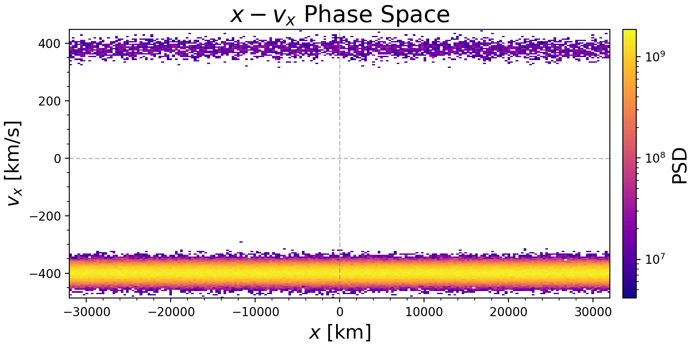
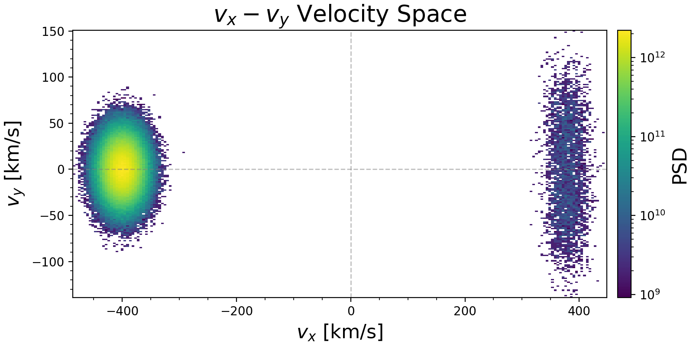
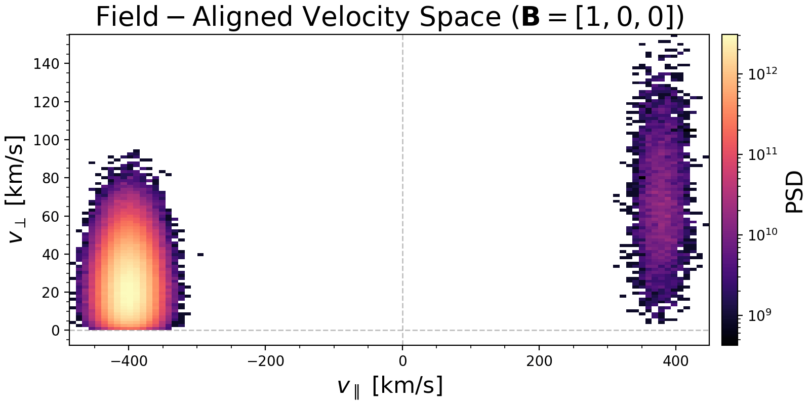
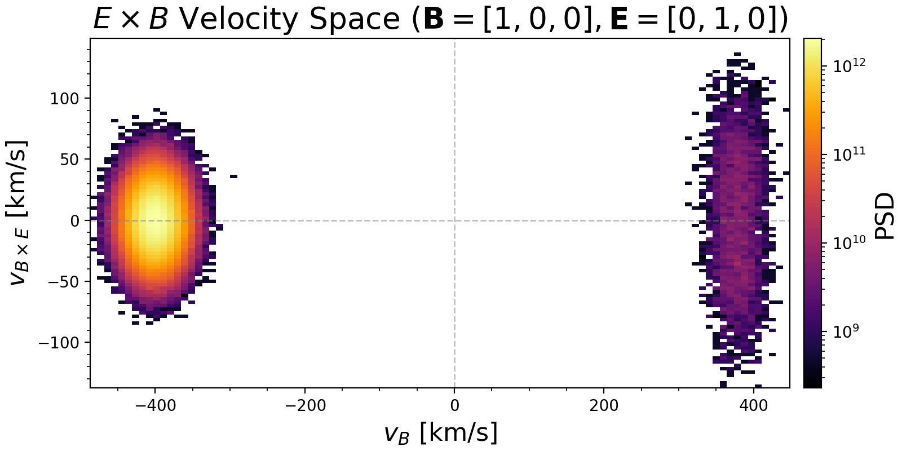

# AMReX Particle Data

We provide support for reading and analyzing AMReX particle data.

## Loading Data

To load AMReX particle data:

```julia
data = AMReXParticle("path/to/data_directory")
```

This will parse the header and prepare for lazy loading of particle data.

## Phase Space Plotting
 
We can calculate and plot the phase space density distribution of particles.
 
First, load the PyPlot extension. The `plot_phase` function automatically calculates the density and plots it.

```julia
using PyPlot

plot_phase(data, "x", "vx"; 
   bins=100, 
   x_range=(-10, 10), 
   y_range=(-5, 5),
   log_scale=true,
   plot_zero_lines=true,
   normalize=true
)
```

Example plots for phase space ($x, v_x$) and velocity space ($v_x, v_y$) generated from AMReX particle data:




We can also calculate the phase space density histogram directly without plotting:

```julia
# 1D density
hist1d = get_phase_space_density(data, "vx")

# 2D density
hist2d = get_phase_space_density(data, "x", "vx"; bins=(100, 50))

# 3D density
hist3d = get_phase_space_density(data, "vx", "vy", "vz"; bins=50)

# Weighted 2D density (automatically detects "weight" component if present)
# or passes weights explicitly if not in data
hist2d_w = get_phase_space_density(data, "v_parallel", "v_perp")
```

We can also apply coordinate transformations to the particle data.

1. Transformation with only B field. This decomposes velocity into parallel and perpendicular components relative to B.

```julia
transform_b = get_particle_field_aligned_transform([1.0, 0.0, 0.0])

plot_phase(data, "v_parallel", "v_perp"; 
   transform=transform_b,
   bins=50,
   log_scale=true
)
```

Example plot in field-aligned coordinates:



2. Transformation with both B and E fields. This creates an orthonormal basis ($v_B$, $v_E$, $v_{B \times E}$), where $v_B$ is along B, $v_E$ is along the perpendicular component of E, and $v_{B \times E}$ is along the ExB drift direction.

```julia
transform_eb = get_particle_field_aligned_transform([1.0, 0.0, 0.0], [0.0, 1.0, 0.0])

plot_phase(data, "v_B", "v_BxE"; 
   transform=transform_eb,
   bins=50,
   log_scale=true
)
```

Example plot in ExB drift coordinates:


 
## Particle Classification

You can classify particles into Core Maxwellian and Suprathermal populations using `classify_particles`. This function allows for specifying a spatial region and handling velocity distributions in 1D, 2D, or 3D.

```julia
# range can be specified by keywords x_range, y_range, z_range locally
core, halo = classify_particles(data; 
    x_range=(-1.0, 1.0), 
    y_range=(-1.0, 1.0), 
    z_range=(-1.0, 1.0),
    vdim=3,          # Velocity dimension (1, 2, or 3)
    vth=1.0,         # Core thermal velocity (required)
    nsigma=3.0,      # Separation threshold
    bulk_vel=nothing # Auto-detect if nothing
)
```

The function returns two matrices containing the classified particles. If `bulk_vel` is not provided, it is automatically estimated from the peak of the velocity distribution.
