# Data Visualization

We provide plot recipes for Plots.jl, Makie.jl, and wrappers for PyPlot.jl.

The recipes for Plots.jl and Makie.jl will work on all kinds of plots given the correct dimensions, e.g.

```julia
using Plots

plot(bd, "p")
contourf(bd, "Mx", xlabel="x")
```

See the official documentation for Plots.jl for more information.

On the other hand, most common 1D and 2D plotting functions are wrapped over their Matplotlib equivalences through PyPlot.jl.
To trigger the wrapper, `using PyPlot`.
Check out the documentation for more details.

## Quick exploration of data

Using the same plotting functions as in Matplotlib is allowed, and actually recommended. This takes advantage of multiple dispatch mechanism in Julia.
Some plotting functions can be directly called as shown below, which allows for more control from the user.
`using PyPlot` to import the full capability of the package, etc. adding colorbar, changing line colors, setting colorbar range with `clim`.

For 1D outputs, we can use `plot` or `scatter`.

- line plot

```julia
plot(bd, "p", linewidth=2, color="tab:red", linestyle="--", linewidth=2)
```

- scatter plot

```julia
scatter(bd, "p")
```

For 2D outputs, we can select the following functions:

- `contour`
- `contourf`
- `imshow`
- `pcolormesh`
- `plot_surface`
- `tricontour`
- `tricontourf`
- `plot_trisurf`
- `tripcolor`

with either `quiver` or `streamplot`. By default the linear colorscale is applied. If you want to switch to logarithmic, set argument `colorscale=:log`.

- contour

```julia
contour(bd, "p")
```

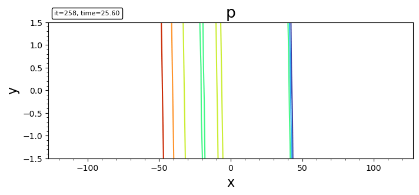

- filled contour

```julia
contourf(bd, "p")
contourf(bd, "p"; levels, plotrange=[-10,10,-Inf,Inf], plotinterval=0.1)
```

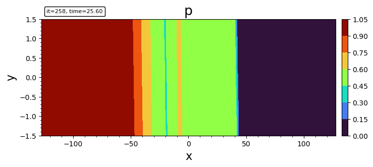

- imshow

```julia
imshow(bd, "p")
```


- pcolormesh

```julia
pcolormesh(bd, "p")
```

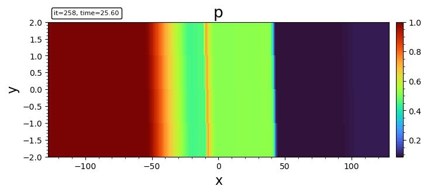

- surface plot

```julia
plot_surface(bd, "p")
```

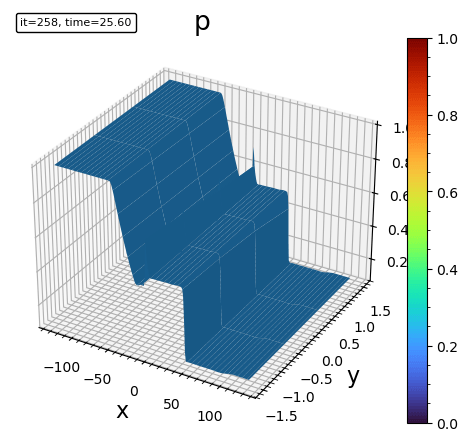

- triangle surface plot

```julia
plot_trisurf(bd, "p")
```

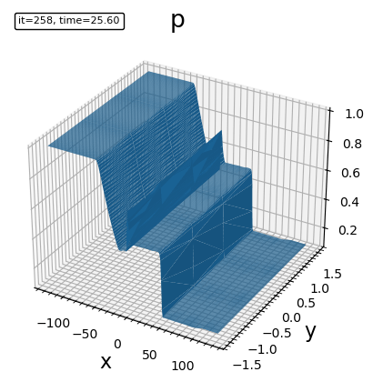

- tricontour

```julia
tricontour(bd, "p")
```

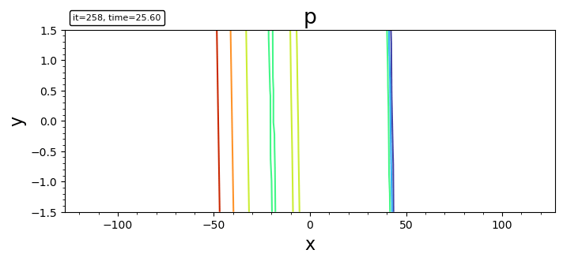

- triangle filled contour plot

```julia
tricontourf(bd, "p")
```


- tripcolor

```julia
tripcolor(bd, "p")
```

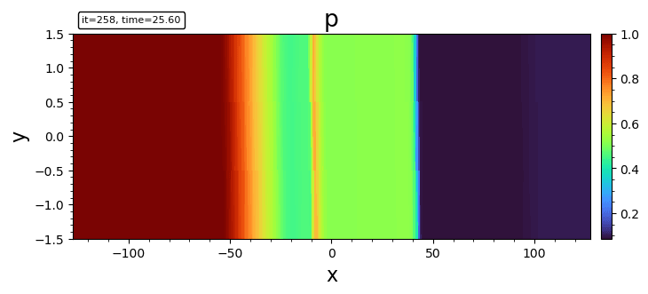

- streamline

```julia
streamplot(bd, "bx;bz")
streamplot(bd, "bx;bz"; density=2.0, color="k", plotinterval=1.0, plotrange=[-10,10,-Inf,Inf], broken_streamlines=false)
```

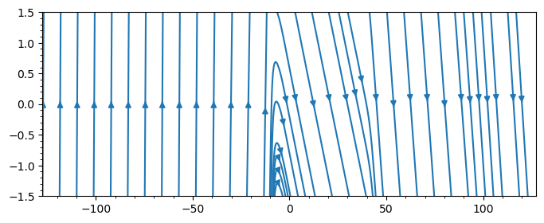

By default Matplotlib may break streamlines at boundaries or where data is sparse. To ensure continuous lines, set `broken_streamlines=false`.

- quiver (currently only for Cartesian grid)

```julia
quiver(bd, "ux;uy"; stride=50)
```

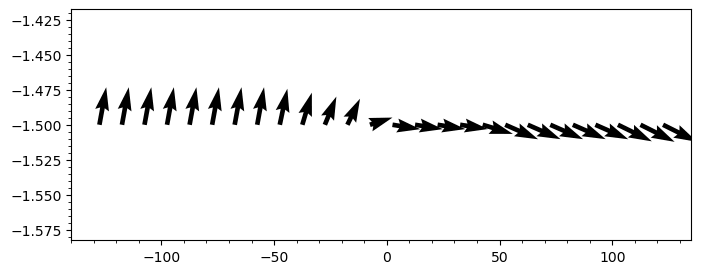

- streamline + contourf

```julia
file = "y.out"
bd = load(file)

DN = matplotlib.colors.DivergingNorm
cmap = matplotlib.cm.RdBu_r

contourf(bd, "uxS0", 50; plotrange=[-3,3,-3,3], plotinterval=0.05, norm=DN(0), cmap)
colorbar()
streamplot(bd, "uxS0;uzS0"; density=2.0, color="g", plotrange=[-3,3,-3,3])
xlabel("x"); ylabel("y"); title("Ux [km/s]")

contourf(bd, "uxS0", 50; plotinterval=0.05, norm=DN(0), cmap)
colorbar()
axis("scaled")
xlabel("x"); ylabel("y"); title("uxS0")
```

## Mesh Plotting

For visualizing the grid structure, we provide `plotgrid`.

For structured or curvilinear 2D data (`BatsrusIDL{2, TV}`), it shows the individual cell boundaries.

```julia
plotgrid(bd)
```

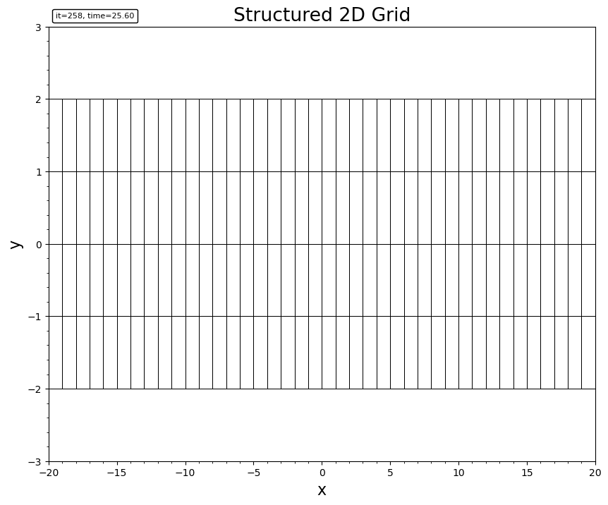

For block-adaptive tree (AMR) data (`Batl`), it visualizes the leaf block boundaries. It supports both 2D and 3D.

```julia
# 2D AMR mesh
plotgrid(batl)

# 3D AMR mesh
plotgrid(batl)

# 2D slices of 3D AMR mesh
fig, axes = plt.subplots(1, 3)
plotgrid(batl, axes[1], dir="x", at=0.0)
plotgrid(batl, axes[2], dir="y", at=0.0)
plotgrid(batl, axes[3], dir="z", at=0.0)
```

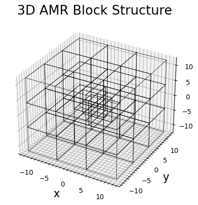
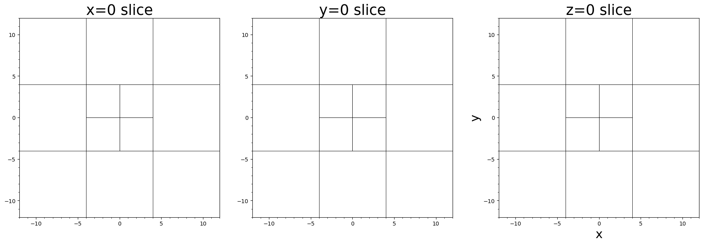

For unstructured Tecplot data, it renders the cell connectivity.

```julia
plotgrid(head, data, connectivity)
```

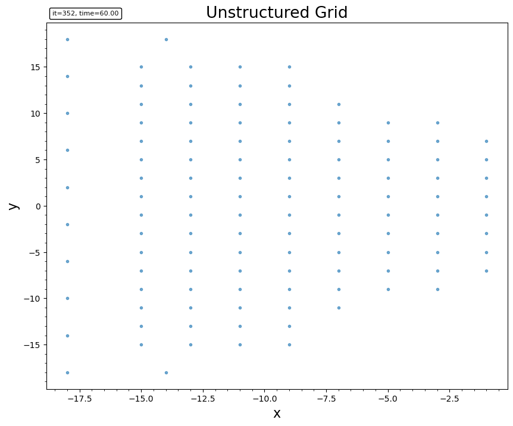

For 3D outputs, we may use `cutplot` for visualizing on a sliced plane, or `streamslice` to plot streamlines on a given slice.

## Tracing

The built-in `streamplot` function in Matplotlib is not satisfactory for accurately tracing. Instead we recommend [FieldTracer.jl](https://github.com/henry2004y/FieldTracer.jl) for tracing fieldlines and streamlines.

An example of tracing in a 2D cut and plot the field lines over contour:

```julia
file = "test/y=0_var_1_t00000000_n00000000.out"
bd = load(file)

bx = bd.w[:,:,5]
bz = bd.w[:,:,7]
x  = bd.x[:,1,1]
z  = bd.x[1,:,2]

seeds = select_seeds(x, z; nSeed=100) # randomly select the seeding points

for i in 1:size(seeds)[2]
   xs = seeds[1,i]
   zs = seeds[2,i]
   # Tracing in both direction. Check the document for more options.
   x1, z1 = trace2d_eul(bx, bz, xs, zs, x, z, ds=0.1, maxstep=1000, gridType="ndgrid")
   plot(x1, z1, "--")
end
axis("equal")
```

Currently the `select_seeds` function uses pseudo random number generator that produces the same seeds every time.
